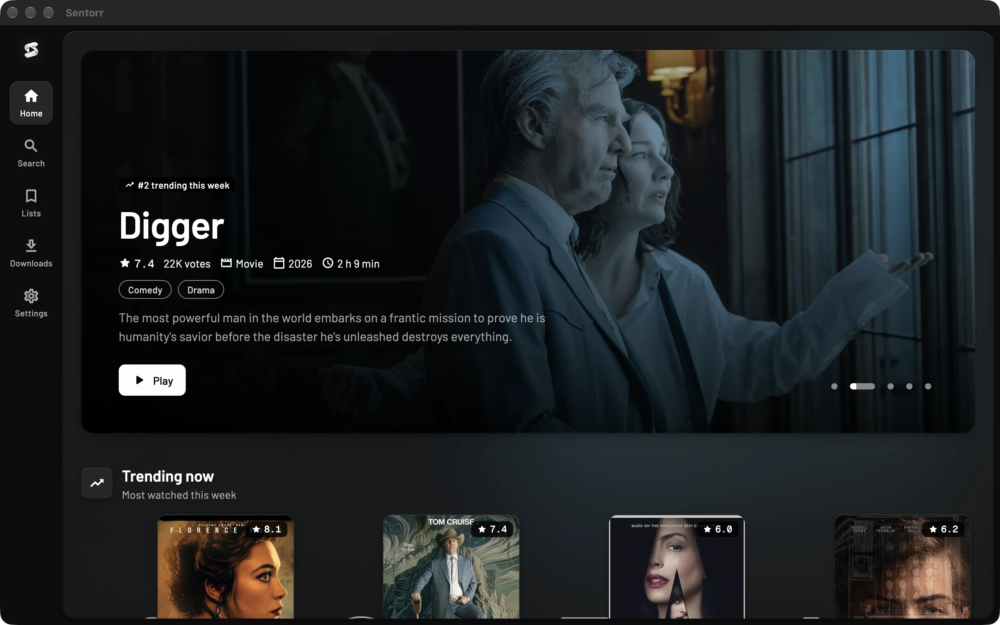
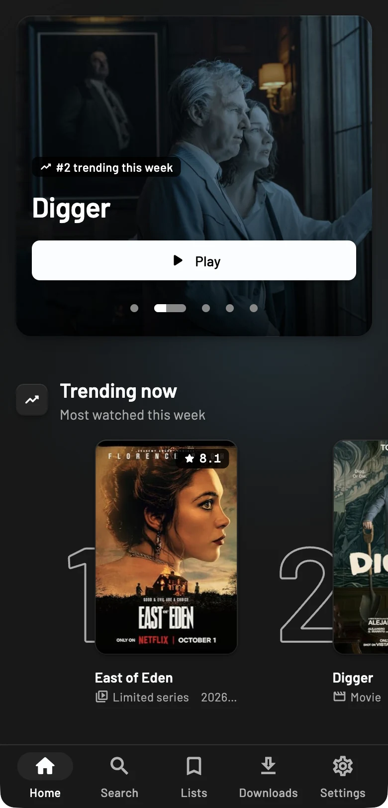
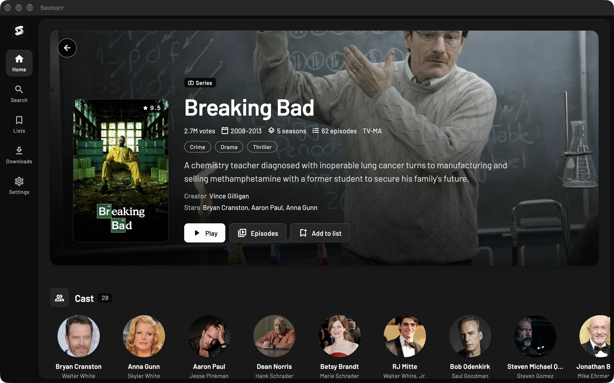
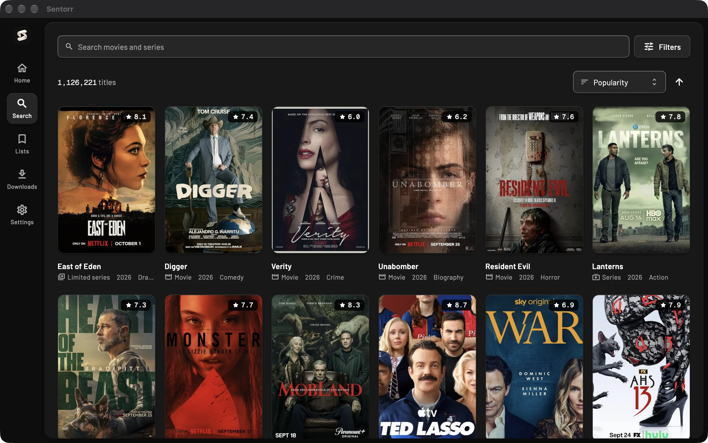
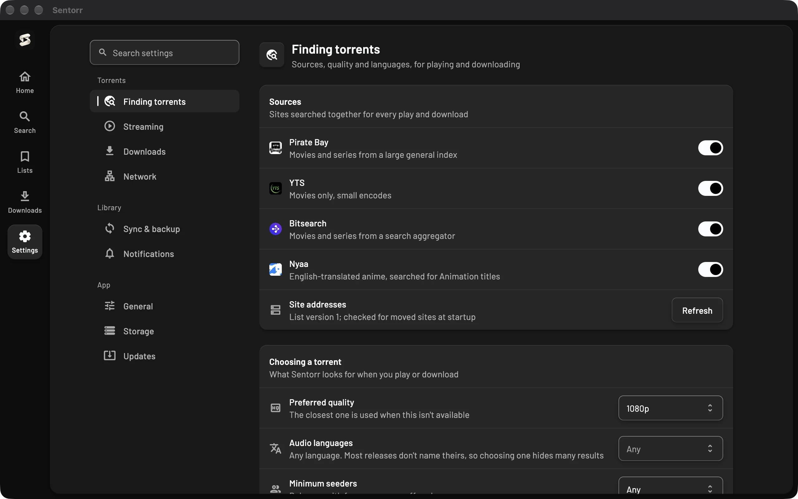

<h1 align="center">
   Sentorr
</h1>

<p align="center">
  A less sketchy way to stream movies and TV.<br>
  Movies and TV · Android · Linux · macOS · Windows
</p>

<p align="center">
  <a href="https://github.com/SenZmaKi/Sentorr/actions/workflows/ci.yml"></a>
  <a href="https://github.com/SenZmaKi/Sentorr/releases"></a>
</p>

<p align="center">
  <a href="#installation">Installation</a> •
  <a href="#features">Features</a> •
  <a href="#building-from-source">Building from source</a> •
  <a href="#support">Support</a> •
  <a href="#faq">FAQ</a> •
  <a href="#contribution">Contribution</a>
</p>

<table align="center">
  <tr>
    <td></td>
    <td></td>
  </tr>
</table>

<table align="center">
  <tr>
    <td></td>
    <td></td>
    <td></td>
  </tr>
</table>

## Installation

Get Sentorr for your device from the
[download page](https://senzmaki.github.io/Sentorr/download/). You can also
browse every version on [GitHub Releases](https://github.com/SenZmaKi/Sentorr/releases).

- **Windows 10/11:** x64 installer. ARM PCs run it through Windows emulation.
- **Linux:** x86_64 or aarch64 AppImage.
- **macOS:** one universal DMG for Apple silicon and Intel.
- **Android:** ARM64, 32-bit ARM, or x86_64 APK.

The Windows installer isn't code-signed yet and the macOS app is ad-hoc signed,
so SmartScreen and Gatekeeper ask before the first launch. The download page
shows how to continue.

### Nightly builds

[Sentorr Nightly](https://senzmaki.github.io/Sentorr/download/?channel=nightly)
is built every day from the latest code. It installs alongside the stable app
with its own icon, settings and downloads, and updates itself from the nightly
channel. Expect bugs. Stable and nightly can still pair, sync and share a
Google Drive backup when their data formats match. See
[nightly releases](docs/nightly-releases.md).

## Features

- **Plays while it downloads:** playback starts after a short buffer, and
  seeking fetches that part of the file first.
- **Finds the right torrent:** results are matched to the exact title and
  episode, then ranked by quality, size and seeders across Pirate Bay, YTS,
  Bitsearch and Nyaa.
- **A proper player:** built on mpv, with subtitles, playback speed, a mini
  player, pop-out and YouTube's keyboard shortcuts.
- **Downloads:** keep movies, episodes or whole seasons for offline viewing.
- **Lists and new episodes:** track what you're watching, and hear when new
  episodes air or have them downloaded.
- **Your network, your rules:** speed limits, a proxy, and binding torrent
  traffic to your VPN's network interface.
- **Device sync:** pair devices on your network to share watch history and lists,
  and play each other's downloads.
- **Backups:** keep your history and lists in a file or on Google Drive.

## Support

- Support development through [GitHub Sponsors](https://github.com/sponsors/SenZmaKi).
- Leave a star so more people can find Sentorr.
- Found a bug or have an idea? [Open an issue](https://github.com/SenZmaKi/Sentorr/issues)
  or [contribute](#contribution).

## Building from Source

Install [Flutter](https://docs.flutter.dev/get-started/install) and the tooling
for your target platform, then run:

```sh
git clone https://github.com/SenZmaKi/Sentorr.git
cd Sentorr
flutter pub get
flutter run
```

The native torrent engine comes from
[libtorrent_dart](https://github.com/SenZmaKi/libtorrent_dart), whose build hook
downloads prebuilt libraries for your platform.

On Android, Google Drive uses native Google Play services authorization; the
package name and signing certificate must be registered in Google Cloud (see
[Android OAuth clients](docs/android-drive-oauth.md)). No local defines are needed
for Android Drive access.

Desktop Google Drive backup needs OAuth credentials at build time. Put
`GOOGLE_DRIVE_CLIENT_ID` and `GOOGLE_DRIVE_CLIENT_SECRET` in a
`dart_defines.local.json` (ignored by Git) and run
`./tool/run.sh` (pass device or other run options as usual, e.g.
`./tool/run.sh -d macos`). The local VS Code Sentorr launch configuration also
loads this file automatically. Without the credentials the Drive option is hidden.

Use `flutter build apk`, `flutter build linux`, `flutter build macos` or
`flutter build windows` for a local build on a supported host. Release signing
and packaging are handled by the [release workflow](.github/workflows/release.yml);
see [signing keys](docs/signing-keys.md).

## FAQ

<details>
<summary>Is Sentorr free?</summary>

Yes. It's free and open source, with no accounts, subscriptions or ads.

</details>

<details>
<summary>Where do the movies and shows come from?</summary>

Sentorr doesn't host anything. It searches public torrent indexes and streams
from people sharing those files over BitTorrent. Title information comes from
IMDb.

</details>

<details>
<summary>Do I need a VPN?</summary>

While you stream or download, your IP address is visible to other peers, and
the rules differ by country. Sentorr can send torrent traffic only through your
VPN's network interface, or through a proxy.

</details>

<details>
<summary>Do I need a separate video player or codecs?</summary>

No. Sentorr's player is built on mpv and bundled with the app.

</details>

## Contribution

- Open pull requests against `master` and run `flutter analyze` and
  `flutter test` before submitting.
- The app lives in `lib/`, the torrent streaming engine in
  `packages/torrent_stream/`, and the website in `website/`.
- Read [DESIGN.md](DESIGN.md) before UI work, and the
  [sync architecture](docs/sync/ARCHITECTURE.md) before changing sync or
  backups.

## Legal Disclaimer

Sentorr searches publicly available torrent indexes. It does not host, upload or
control any media or third-party sites. BitTorrent is peer to peer: while you
stream or download, you also share with others. Respect copyright and the laws
and terms that apply to you. See the
[legal notice](https://senzmaki.github.io/Sentorr/legal/).
