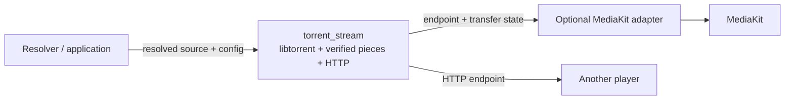

# Reusable torrent playback engine

Status: core implemented in `packages/torrent_stream`, based on the Streaming Lab audit. Sentorr wires it to MediaKit in `lib/player/stream/`: `TorrentPlayback` owns one session per item (resolving a torrent when the queue item has none, then choosing its file), `MediaKitTorrentAdapter` applies the player policy below and routes seeks through `prepareSeek`.

## Module placement

Use a standalone pure Dart package, `packages/torrent_stream`, for native torrent delivery. It imports neither Sentorr nor Flutter, MediaKit, Riverpod, catalog models, app settings, theme, or persistence providers. A consuming app passes configuration, a resolved torrent source, its cache root, and an explicit file index. The package owns the torrent session, verified piece reads, priorities, HTTP server and its temporary child directory.

A second optional package, `packages/torrent_stream_media_kit`, adapts the engine to MediaKit. It owns player properties, playable-cache readiness, seeks and playback observation. It must not own catalog resolution or global app settings. Initially Sentorr can keep this adapter under its playback feature; split it into its own package when another consumer needs it. Do not make the core depend on the adapter.

The public interface is deliberately small: one session, one selected file, one HTTP endpoint. A multi-torrent manager, download queue, resolver and background platform service are separate work. Native handles, piece indices, HTTP range mechanics and isolate message maps remain private.

## Engine interface

A caller creates a session before starting asynchronous acquisition, so Stop can close it while magnet metadata or container preparation is pending. Do not use a factory that returns the session only after metadata completes.

- `open(TorrentSource)` returns immutable metadata/file entries. Sources are magnet URI, torrent-file path or copied torrent metadata bytes. The engine accepts known peers/trackers when provided; it does not search or rank sources.
- `prepareFile(fileIndex)` prepares bounded verified opening bytes and returns a `TorrentStream` containing the loopback URL and selected file metadata. The URL remains valid until session close. It does not mean video timestamps, decoded frames or ten seconds of playable cache are ready.
- `prepareSeek()` cancels obsolete HTTP demands without deleting completed pieces or restarting peer discovery. A player adapter calls it immediately before requesting a new time position. An ordinary HTTP player still works through range requests and disconnect cancellation, but cannot proactively cancel obsolete demands through HTTP alone.
- `addPeers(peers)` supplies explicit newly discovered peers without reopening the source.
- `setTransferPaused(bool)` controls downloading independently of playback. A player pause can continue downloading; callers should not silently conflate the two.
- `close()` is idempotent, interrupts pending open/preparation/read operations, shuts down the server/native session, deletes only the owned session cache directory, closes state delivery and releases its worker lease. The shared worker exits only after its final session closes.
- `state` and a broadcast `states` stream expose current phase, metadata, selected file, connected peers/seeds, known peers and pending connections, download/upload payload rates and totals, native transfer activity, verified torrent/selected-file bytes and fatal typed failures. HTTP read failures are observed by the player through aborted sockets. New subscribers read `state` for the initial snapshot. This is transfer state; it contains no player time, duration, mute or buffering state.

Do not choose the largest file inside the library. Multi-episode torrents require resolver/application intent; pad files and zero-length entries are rejected for selection. Open exactly once per session; use a new session for a different source. Select exactly one file for a prepared session initially; file switching should use another session until its lifetime is designed explicitly.

## Lifecycle and failures

`idle → acquiringMetadata → metadataReady → preparing → serving → closing → closed`.

`transferPaused` is an independent state property, not a substitute for the lifecycle phase. Fatal native/startup errors produce a typed failure and leave close available. A cancelled operation reports cancellation rather than format failure. Metadata, piece-availability and native disk-read timeouts have distinct error codes. HTTP reads that fail after headers abort the connection and emit diagnostics; they never fabricate EOF, zeros or verified data. Ordinary seek/disconnect cancellations do not become fatal playback errors.

Commands and replies must use request IDs and tracked completers. Handle isolate startup failure, unexpected isolate exit and close while a command is pending. Close cancellation bypasses a busy serial command queue; shutdown then serializes destruction. Reject commands after closing without spawning another worker. Await native disk jobs before deleting owned cache data. Preserve the original source `.torrent` or media file; never recursively delete the caller's cache root.

All native C++ calls, disk/session destruction and the single alert pump per native session belong to a shared worker isolate. Sessions created in one owner Dart isolate share that worker; all calls into the binding registries are serialized there. Independent owner isolates must not create competing runtimes until the native registries support that usage. State updates are bounded (approximately twice per second), and routine state omits peer IPs or source credentials. State and failures are typed; raw native logs are not exposed by the current package.

## Configuration and ownership

Required configuration: application-supplied cache root. The engine creates a unique child folder for each session; all lifetime/cleanup ownership remains internal. Do not hard-code Sentorr directory names or discover platform app directories in the library.

Initial delivery defaults from the audit: 40 Mbps (5,000,000 bytes/second) download ceiling, 16 MiB read-ahead target, 24 MiB owned-piece LRU, 60-second metadata wait, 45-second piece wait, 15-second native read completion, bounded head/tail preparation and current-piece-only urgent scheduling. Unlimited transfer is explicit. Validate configuration at runtime; use byte units in the library rather than UI Mbps units.

Transport is explicit (`tcpOnly` or `mixedTcpUtp`). TCP-only is the demonstrated local lab baseline, not a universal recommendation: it can exclude uTP-only peers. Preserve mixed compatibility and UDP DHT/tracker discovery. Investigate/adapt the transport policy on real devices before production rollout.

The HTTP server always binds loopback on an ephemeral port with an unpredictable session path. It supports HEAD, full GET, single/suffix/open-ended ranges, bounded concurrency, backpressure and disconnect cancellation. It is not a remote streaming server. No configurable public bind address or authenticated remote API is needed. Limit cache data and active requests through configuration only where a real consumer requirement exists.

Keep time-critical scheduler details internal. A sixteen-megabyte window is a target, not a hard allocation limit: at least the current piece and useful lookahead may require more when pieces are unusually large. Native verified reads require whole pieces, even when a consumer asks for 64 KiB. LRU limits do not bound libtorrent's own buffers, HTTP socket buffers or player cache. Document these memory and latency characteristics.

## Player adapter

The adapter accepts an existing MediaKit Player and engine session. Ownership is explicit: closing playback releases the engine endpoint; disposing an externally supplied Player remains the caller's responsibility unless an owned-player constructor is used later.

Player options are separate configuration: ten-second playable ready target, sixty-second forward-cache target, 64 MiB demuxer cache and 16 MiB back cache, sixty-second HTTP timeout. A ready target is not a mandatory wall-clock delay, and player EOF/cache behavior can resume with less data. Expose mute and playback pause at the player/application layer, not the torrent engine.

Sequence: create session → open source → choose file → prepare file → configure player → open endpoint → observe actual demuxer cache/playback readiness. Stop is available at every stage. For a seek: cancel obsolete engine reads → request player seek → observe playable progression/cache waiting. Keep metadata/byte readiness and player readiness distinct in names and UI.

MediaKit's shorter HTTP timeout caused cancelled reads and retries; the adapter restores 60 seconds so it exceeds the engine's 45-second piece wait. A different HTTP player needs an equivalent timeout. Bounded engine preparation reduces initial cold range reads, but every player must still parse its container. Custom libmpv IO is not needed for the audited design.

Player controls or overlays subscribe directly to `session.states` with `session.state` as their initial snapshot. Torrent telemetry does not pass through MediaKit’s decoder. Speeds are bytes per second; selected-file progress is verified availability, not playable duration.

Playback observation combines demuxer cache duration/cache-pause with position progression, rather than relying exclusively on MediaKit buffering events. Progress feedback belongs to the app: elapsed loading time, connected peers, verified bytes/cache duration, a slow-source explanation after thirty seconds, and cancellation. Never force playback merely because a wall-clock loading cap expired.

## Resolver/application integration later

The resolver provides a source and explicit file choice; it does not provide a MediaKit Player or native libtorrent handle. To reuse discovery, retain the same engine session from metadata inspection through playback, or supply cached `.torrent` bytes. Do not reopen the magnet after selection and start discovery again. Passing an existing native handle between isolates/packages is unsupported.

Sentorr maps persisted settings into core and player config, maps engine/player state into Riverpod presentation state, owns app directories and platform permissions, and wires catalog/source choices to sessions. Keep resolution/network-source ranking separate from playback delivery. Android foreground execution, sandboxed file access, persistent resume caches, subtitle sidecars and multiple active sessions require separate lifecycle work and are not implied by this design.

## Verification contract

Retain the lab as the performance reference. Package tests cross the public interface, with a real controlled seed where native delivery matters. Check exact verified ranges including file-boundary/pad/short-final-piece layouts; disconnect/seek/close cancellation; close during unavailable metadata and preparation; paused state observers and unexpected worker exit; bounded memory/request windows; seed interruption/reconnection; pause independently of player pause; isolate failure; cleanup only of owned children; and multiple independent consumer sessions.

The optional MediaKit adapter needs native release playback verification for mute, playable-cache readiness, forward/backward/rapid seeks, pause/resume and slow-source recovery. Unit tests of configuration assignment cannot replace those checks. Start with macOS evidence and clearly separate static portability from Windows/Linux/mobile runtime validation.

## Evidence

- [Final lab audit](../../tool/streaming_lab/FINAL_AUDIT.md): transport reproduction, timeout comparisons and actual-default release playback.
- [WebTorrent source comparison](../../tool/streaming_lab/WEBTORRENT.md): narrow urgent windows, optional uTP dependency and no special unverified-byte streaming.
- [Codec lab validation](../../tool/codec_lab/VALIDATION.md): native codec/platform limits.
- Lab engine implementation to extract privately: `native_session`, `torrent_bytes`, `piece_scheduler`, `media_bootstrap`, `media_server`, `http_range`, `cancellation`.
- Do not extract `LabSession`, its synthetic seed controls, environment policy flags, report sampling, UI controller or raw-map worker interface as the public library interface.

## Implemented verification

The pure Dart package has a pinned binding dependency and explicit local-native-build instructions. Fourteen tests pass on macOS, including exact bytes from a real controlled seed, seed interruption/recovery, independent sessions sharing the native worker, close during metadata/container preparation, and caller/source-file preservation. Analysis is clean. Local-service discovery is disabled after controlled loopback peers were replaced by self-discovery; explicit peers and DHT/trackers remain supported. No app dependency or MediaKit adapter has been wired.
